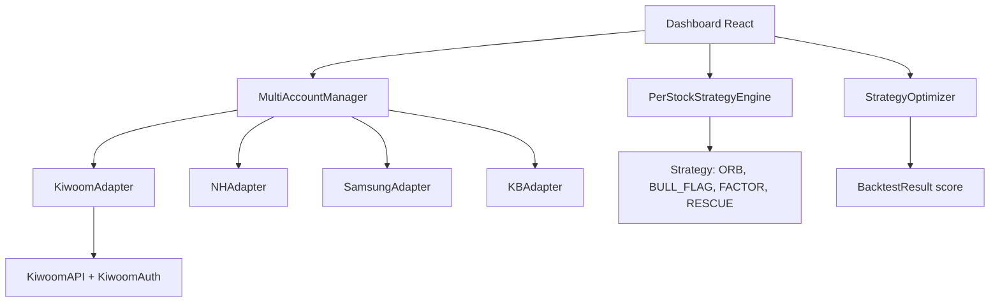

# Design: kiwoom_trader

## 1. Architecture


## 2. Data Model
| Table | Column | Type | Description |
|-------|--------|------|-------------|
| Position | code, qty, avg, cur, pl, pl_pct | int/float | 보유종목 |
| Account | id, broker, name, cash, eval | string/int | 증권사 계좌 |
| StrategyMapping | code -> strategy_id | dict | 종목별 전략 |
| BacktestResult | total_return, win_rate, mdd, sharpe, score | float | 최적화 결과 |

## 3. API Spec
- POST /api/balance -> {accounts, summary, all_positions}
- POST /api/strategy/set {code, strategy_id}
- POST /api/strategy/run_single {code} -> {should_sell, reason}
- POST /api/strategy/run_selected {codes: []}
- POST /api/optimizer/run {code} -> BacktestResult[]
- GET /api/optimizer/recommend -> {code: {strategy, params, expected}}

## 4. Folder Structure
```
/api
  kiwoom_api.py
  kiwoom_auth.py
  multi_broker_api.py
  strategy_engine.py
  strategy_optimizer.py
/docs
  01-prd.md
  02-design.md
  03-tasks.md
  04-test-plan.md
  05-verification.md
/memory
  progress.md
  decisions.md
```

## 5. Tech Stack & Decision
- Python: Kiwoom REST API, yaml config
- React: CDN + Babel, useState for strategy change (고정)
- Paper trading default for safety
- ADR-001: 전체 실행 제거, run_single/run_selected만 허용 (2026-09-21)
- ADR-002: 평가 기준 4가지 가중치 - 수익 40%, MDD 30%, 승률 20%, 샤프 10%
